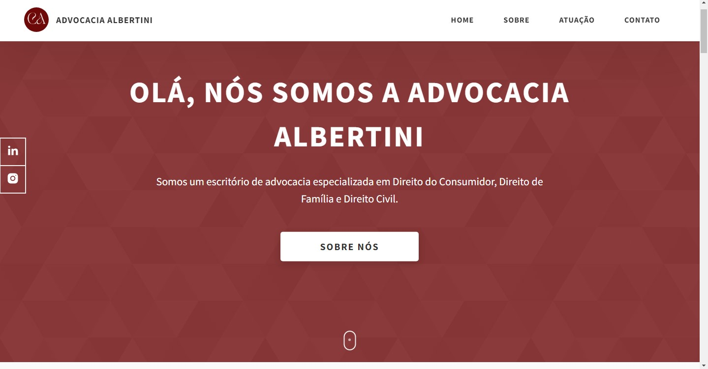
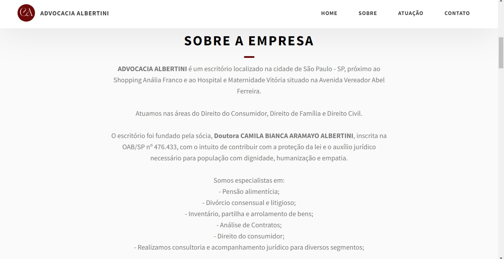
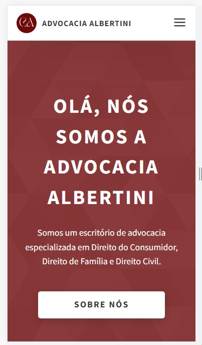
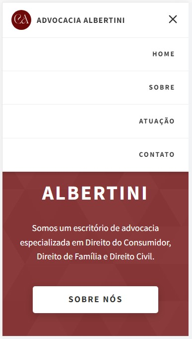
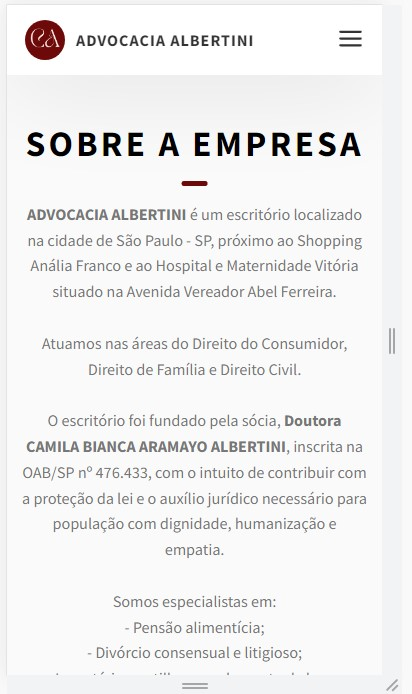

<!-- HEADER -->

<!-- TITLE -->
<h1 align="center" alt="title">
  
    <b> TEMPLATE ADVOCACIA ALBERTINI </b>
  
</h1>

> Esse projeto foi desenvolvido como um modelo de template para uso comercial do escritório de Advocacia Albertini. Um projeto responsivo no qual foi desenvolvido utilizando todo conhecimento adquirido através do curso de Desenvolvimento de Sistemas.

 

<!-- Habilidades Principais-->
&nbsp;
&nbsp;
&nbsp;
&nbsp;
&nbsp;

### Layout Project

### Layout Responsivo

---
<!-- FOOTER -->
 

  <table>
    <tr>
      <td>
        
      </td>
      <td>
        
      </td>
      <td>
        
      </td>
    </tr>
  </table>

